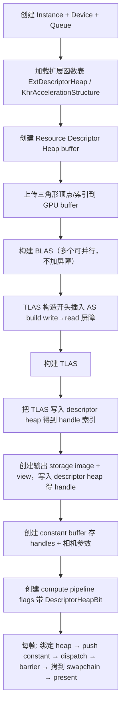

# Vulkan RayQuery 三角形最小示例 —— 设计与实现说明

> 目标读者：负责实现 demo 的 AI / 开发者
> 目标：**不经过 Zenith.NET 抽象层**，直接用 `Silk.NET.Vulkan` + 本仓库的 `ExtDescriptorHeap.cs`（`VK_EXT_descriptor_heap` 手动绑定），写一个最小可运行示例：
> **计算着色器 + RayQuery（inline ray tracing）通过 descriptor heap（bindless）访问 TLAS，向一张 storage image 写出一个三角形，再拷贝/呈现到窗口。**
>
> 这个 demo 的核心用途是**隔离验证** "descriptor heap 扩展 + 加速结构" 的组合用法是否正确，用来定位康奈尔盒子光追版本在 Vulkan 后端下无法正常显示的问题。
>
> ⚠️ **参考代码位置**：本 demo 是**单独新建的项目**，与参考仓库不在同一解决方案内，因此下文所有链接/路径都是**相对于参考仓库根目录**而言。需要查看任何参考代码、真实用法、结构体定义时，请到以下仓库目录下查找：
>
> ```
> C:\Users\13247\source\repos\qian-o\Zenith.NET
> ```
>
> 其中 Vulkan 后端在 `sources/Zenith.NET.Vulkan/`，核心库在 `sources/Zenith.NET/`，康奈尔盒子示例在 `sources/Experiments/CornellBox/`。完整文件清单见 §12。

---

## 0. 背景：为什么要做这个最小示例

康奈尔盒子的光追渲染器（[PathTracingRenderer.cs](../CornellBox/Renderers/PathTracingRenderer.cs)）走的是：
compute pipeline + RayQuery + bindless descriptor heap（TLAS handle / storage buffers / storage textures 都通过 `ResourceHandle` 索引），常量通过 `CmdPushData` 推送 constant buffer 的 device address。

这条链路在 Vulkan 后端涉及三个较新的机制叠加：

1. `VK_EXT_descriptor_heap` —— bindless 描述符堆（本仓库手动绑定在 [ExtDescriptorHeap.cs](../../Zenith.NET.Vulkan/ExtDescriptorHeap.cs)）；
2. `VK_KHR_acceleration_structure` + `VK_KHR_ray_query` —— 加速结构 + inline 光追；
3. Slang 编译到 SPIR-V 时启用 `spvDescriptorHeapEXT` capability，把 `DescriptorHandle<T>` 映射为 descriptor heap 索引。

任何一环出问题（描述符写入类型不对、堆绑定缺失、AS 之间缺同步屏障、shader 里 handle 解引用方式不对、图像布局不对）都会导致"能跑但画面全黑/错乱"。最小示例把变量降到最低（1 个三角形、1 个 BLAS、1 个 TLAS、1 张输出图像、1 个 constant buffer），便于二分定位。

**已知重点怀疑区（实现时重点核对，见 §9）**：
- TLAS handle 的 descriptor 写入用 `DescriptorType.AccelerationStructureKhr` + `PAddressRange`（device address），需确认设备/驱动接受这种写法。
- storage buffer（顶点/索引/材质）的 descriptor 写入用 `DescriptorType.StorageBuffer` + `PAddressRange`，需确认 shader 侧解引用与 CPU 侧 handle 索引一致。
- 输出 storage image 的 layout 必须是 `General`，且 dispatch 前后要有正确的 barrier。
- push data（constant buffer device address）+ `spvDescriptorHeapEXT` 的解引用链路是否正确。

> **AS 同步说明（非缺陷）**：BLAS→TLAS 的同步屏障放在 **TLAS 构造开头**（`VKTopLevelAccelerationStructure` 的 `BuildSyncBarrier(AccelerationStructureBuildBitKhr)`），它以 `AccelerationStructureBuildBit` write→read 等待此前**所有** BLAS 构建完成。因此 BLAS 各自构建时**不加屏障**是有意为之——多个 BLAS 可以并行构建，由 TLAS 开头的单个屏障统一同步。这是正确且更优的设计。

---

## 1. 项目结构

在 `sources/Experiments/` 下新建工程 `VulkanRayQueryTriangle`，参考现有 [CornellBox.csproj](../CornellBox/CornellBox.csproj) 的引用方式，但**不引用 Zenith.NET 核心库**（只借用 `Zenith.NET.Vulkan` 项目里的 `ExtDescriptorHeap.cs` 等本地扩展定义 —— 见 §2）。

```
VulkanRayQueryTriangle/
├── VulkanRayQueryTriangle.csproj
├── Program.cs                 # 入口：创建窗口 + 主循环
├── VulkanContext.cs           # instance/device/queue/扩展函数加载
├── DescriptorHeap.cs          # 封装 VK_EXT_descriptor_heap 的资源堆
├── AccelerationStructures.cs  # BLAS + TLAS 构建
├── RayQueryRenderer.cs        # compute pipeline + dispatch + 输出图像
├── Helpers/
│   └── VkHelper.cs            # 内存类型查找、buffer/image 创建等小工具
└── Assets/
    └── Shaders/
        └── RayQueryTriangle.slang
```

`.csproj` 关键点（参考 CornellBox）：

```xml
<Project Sdk="Microsoft.NET.Sdk">
  <PropertyGroup>
    <OutputType>Exe</OutputType>
    <TargetFramework>net10.0</TargetFramework>
    <AllowUnsafeBlocks>true</AllowUnsafeBlocks>
    <Nullable>enable</Nullable>
    <ImplicitUsings>enable</ImplicitUsings>
  </PropertyGroup>

  <ItemGroup>
    <PackageReference Include="Silk.NET.Vulkan" />
    <PackageReference Include="Silk.NET.Vulkan.Extensions.EXT" />
    <PackageReference Include="Silk.NET.Vulkan.Extensions.KHR" />
    <PackageReference Include="Silk.NET.Windowing" />
    <PackageReference Include="Silk.NET.Input" />
    <PackageReference Include="Slangc.NET" />
  </ItemGroup>

  <!-- 直接复用 Vulkan 后端里的本地扩展绑定，避免重写 VK_EXT_descriptor_heap / RayQuery 的 P/Invoke -->
  <ItemGroup>
    <Compile Include="../../Zenith.NET.Vulkan/ExtDescriptorHeap.cs" Link="Vulkan/ExtDescriptorHeap.cs" />
    <Compile Include="../../Zenith.NET.Vulkan/KhrRayQuery.cs" Link="Vulkan/KhrRayQuery.cs" />
    <Compile Include="../../Zenith.NET.Vulkan/KhrShaderUntypedPointers.cs" Link="Vulkan/KhrShaderUntypedPointers.cs" />
  </ItemGroup>

  <ItemGroup>
    <None Update="Assets/Shaders/**"><CopyToOutputDirectory>PreserveNewest</CopyToOutputDirectory></None>
  </ItemGroup>
</Project>
```

> 说明：`ExtDescriptorHeap.cs` 把扩展结构体和 `ExtDescriptorHeap : NativeExtension<Vk>` 类都定义在 `namespace Silk.NET.Vulkan` 下，`Compile Include` 进来后即可像 Silk.NET 内置扩展一样使用。校验实际文件名后再决定是否包含 `KhrRayQuery.cs`（RayQuery 本身在设备上开启即可，shader 侧才真正用到；C# 侧一般不需要它的函数指针）。

---

## 2. 版本与扩展要求（与 Vulkan 后端对齐）

参考 [VKGraphicsContext.cs](../../Zenith.NET.Vulkan/VKGraphicsContext.cs)：

- **API 版本**：Vulkan **1.4**（`Vk.MakeVersion(1,4,0)`），物理设备 `ApiVersion >= 1.4`。
- **Instance 扩展**：`VK_EXT_debug_utils`（可选，validation 输出）、平台 surface 扩展（Win32 用 `VK_KHR_win32_surface` + `VK_KHR_surface`）。
- **Instance 层**：`VK_LAYER_KHRONOS_validation`（强烈建议开，用于抓错）。
- **Device 扩展（最小集合）**：
  - `VK_EXT_descriptor_heap`（bindless，核心）
  - `VK_KHR_acceleration_structure`
  - `VK_KHR_ray_query`
  - `VK_KHR_deferred_host_operations`（AS 扩展的依赖）
  - `VK_KHR_shader_untyped_pointers`（如果 shader 用到 push data 解引用；本 demo 若把 constant 直接放 push data 需要，见 §7）
  - `VK_KHR_swapchain`（呈现用）
- **Feature 链**（`PhysicalDeviceFeatures2.PNext` 依次挂）：
  - `PhysicalDeviceVulkan12Features`：`BufferDeviceAddress = true`（**必须**，descriptor heap 与 AS 都依赖 device address）
  - `PhysicalDeviceVulkan13Features`：`Synchronization2 = true`、`DynamicRendering = true`
  - `PhysicalDeviceAccelerationStructureFeaturesKHR`：`AccelerationStructure = true`
  - `PhysicalDeviceRayQueryFeaturesKHR`：`RayQuery = true`
  - `PhysicalDeviceDescriptorHeapFeaturesEXT`：`DescriptorHeap = true`（`StructureType.PhysicalDeviceDescriptorHeapFeaturesExt()`，值见 ExtDescriptorHeap.cs）
  - （如启用）`PhysicalDeviceShaderUntypedPointersFeaturesKHR`

> `AddNext` 链式挂 pNext 的写法可参考后端 `Extensions.cs` 里的 `AddNext<TChain,TNext>`；本 demo 可自己写一个简化版，或手动设置 `PNext` 指针。

---

## 3. 整体渲染流程



关键顺序保证（**极易出错**）：
1. **descriptor heap buffer 必须先于任何 `WriteResourceDescriptors` 创建并 Map 常驻**。
2. **BLAS build → TLAS build**：TLAS 读取 BLAS 的结果，二者之间需要 `AccelerationStructureBuildBit` 的 write→read 屏障。该屏障放在 **TLAS 构造开头**（见 §6.3），等待此前所有 BLAS 完成；BLAS 之间不加屏障以允许并行。
3. **TLAS build 完成 → 使用（dispatch）**：也需要 `AccelerationStructureWriteBitKhr → AccelerationStructureReadBitKhr` 屏障（后端 `VKTopLevelAccelerationStructure` 在构造里 build 前后各做了一次 `BuildSyncBarrier`）。
4. **输出 image 转 `General` 布局**后才能在 compute 里当 storage image 写；dispatch 后要 barrier 再拷贝。

---

## 4. Descriptor Heap 用法（VK_EXT_descriptor_heap 核心）

这是 demo 的重点，完全参考 [VKDescriptorHeap.cs](../../Zenith.NET.Vulkan/VKDescriptorHeap.cs) 与 [VKDescriptorRegion.cs](../../Zenith.NET.Vulkan/VKDescriptorRegion.cs) 的做法。

### 4.1 概念模型

`VK_EXT_descriptor_heap` 的 bindless 模型：
- 一个 **descriptor heap = 一块普通 `VkBuffer`**（usage 带 `BufferUsageFlags.DescriptorHeapBitExt()`，即 `VK_BUFFER_USAGE_DESCRIPTOR_HEAP_BIT_EXT`，值 `268435456`），host visible 且 **Map 常驻**。
- 描述符不是 `vkUpdateDescriptorSets` 写进 descriptor set，而是通过 `ExtDescriptorHeap.WriteResourceDescriptors(device, count, pResources, pDescriptors)` 把描述符数据**写进这块 buffer 映射出来的 host 内存的指定偏移**。
- shader 通过 **索引**（handle）访问堆里的第 N 个描述符。索引 = `偏移 / 描述符大小`。

### 4.2 堆的布局与创建

查询 `PhysicalDeviceDescriptorHeapPropertiesEXT`（挂在 `PhysicalDeviceProperties2.PNext`）拿到：
- `BufferDescriptorSize` / `ImageDescriptorSize` / `SamplerDescriptorSize`（各类描述符字节大小，用作 stride）
- `MinResourceHeapReservedRange` / `MinSamplerHeapReservedRange`（堆头部保留字节，实际可用描述符从这里之后开始）
- `ResourceHeapAlignment` / `SamplerHeapAlignment`

**Resource heap** 分两个 region（本 demo 都放在同一个 heap buffer 里）：
- `bufferRegion`：容纳 UniformBuffer / StorageBuffer / **AccelerationStructureKhr** 类型描述符（stride = `BufferDescriptorSize`）
- `imageRegion`：容纳 SampledImage / **StorageImage** 类型描述符（stride = `ImageDescriptorSize`）

布局（照抄 `CreateResourceHeap`）：
```
[ reserved (MinResourceHeapReservedRange) ][ bufferRegion (bufferCapacity * bufferStride) ][ imageRegion (imageCapacity * imageStride) ]
```
- `bufferOffset = Align(reservedBytes, bufferStride)`
- `imageOffset  = Align(bufferOffset + bufferCapacity*bufferStride, imageStride)`
- 总大小 = `Align(imageOffset + imageCapacity*imageStride, ResourceHeapAlignment)`
- region 的 `baseIndex = offset / stride`

本 demo 容量可以很小，例如 `bufferCapacity = 16, imageCapacity = 16`。

### 4.3 分配 + 写入描述符

参考 `VKDescriptorHeap.Allocate(ResourceDescriptorInfoEXT info)`：

1. 按 `info.Type` 选 region（buffer 类走 bufferRegion，image 类走 imageRegion）。
2. region 分配一个 `index`（自增或回收栈），算出 `target`（`HostAddressRangeEXT`）：
   ```csharp
   target = new HostAddressRangeEXT((void*)(heapMappedPointer + (nint)(stride * index)), stride);
   ```
3. 调用：
   ```csharp
   descriptorHeap.WriteResourceDescriptors(device, 1, &info, &target);
   ```
4. **shader 可见的 handle = index**（就是这个 uint 索引）。

对应到本 demo 需要写入的 3 个描述符：

| 资源 | DescriptorType | Data 字段 | 说明 |
|------|----------------|-----------|------|
| TLAS | `AccelerationStructureKhr` | `PAddressRange = &DeviceAddressRangeEXT{ Address = tlasDeviceAddress, Size = tlasSize }` | **走 bufferRegion**；device address 由 `GetAccelerationStructureDeviceAddress` 得到（见 §6.4）|
| 顶点 StorageBuffer | `StorageBuffer` | `PAddressRange = &DeviceAddressRangeEXT{ Address = vbDeviceAddress, Size = vbSize }` | 参考 [VKBufferView.cs](../../Zenith.NET.Vulkan/VKBufferView.cs) |
| 输出 StorageImage | `StorageImage` | `PImage = &ImageDescriptorInfoEXT{ PView = &ImageViewCreateInfo, Layout = General }` | 参考 [VKTextureView.cs](../../Zenith.NET.Vulkan/VKTextureView.cs) |

> **易错点**：`ResourceDescriptorDataEXT` 是 union（`[StructLayout(Explicit)]`，所有字段 offset 0）。buffer/AS 用 `PAddressRange`，image 用 `PImage`。传错会导致驱动读到垃圾指针。

### 4.4 命令缓冲开头绑定堆

每次录制（非 transfer 队列）在 `vkBeginCommandBuffer` 之后，绑定资源堆（参考 `VKCommandBuffer.BeginImpl`）：
```csharp
BindHeapInfoEXT resourceBindInfo = new()
{
    SType = StructureType.BindHeapInfoExt(),
    HeapRange = new DeviceAddressRangeEXT(heapBufferDeviceAddress, heapBufferSize),
    ReservedRangeSize = reservedBytes
};
descriptorHeap.CmdBindResourceHeap(commandBuffer, &resourceBindInfo);
```
本 demo 不用 sampler，可以不绑 sampler heap（但若 shader/pipeline 要求，也建一个空的 sampler heap 绑上更稳妥）。

---

## 5. 几何数据（一个三角形）

顶点结构对齐参考 CornellBox 的 `Vertex`（16 字节对齐，方便 shader 里 `float4` 读取）。最小 demo 只需要 position：

```csharp
[StructLayout(LayoutKind.Explicit, Size = 16)]
struct Vertex
{
    [FieldOffset(0)] public Vector3 Position;   // w padding 留 0
}
```

三角形（放在相机正前方，NDC 简化，直接用世界坐标，相机看向 -Z 或 +Z 视 §8 约定）：
```
v0 = ( 0.0,  0.5, 0.0)
v1 = (-0.5, -0.5, 0.0)
v2 = ( 0.5, -0.5, 0.0)
indices = [0, 1, 2]
```

- **顶点 buffer** usage：`ShaderDeviceAddressBit`（隐含，AS 输入需要）+ `AccelerationStructureBuildInputReadOnlyBitKhr` + `StorageBufferBit`（如果 shader 还要读取顶点；本最小 demo shader 里其实不需要读顶点，只判断命中即可，见 §8）。
- 内存：GPU only（或 host visible 直接写，最小 demo 可用 host visible 免去 staging）。
- 分配内存时 **`MemoryAllocateFlags.DeviceAddressBit` 必须开**（参考 VKBuffer 构造），否则 `GetBufferDeviceAddress` 拿不到有效地址。

---

## 6. 加速结构（BLAS + TLAS）

完全参考 [VKBottomLevelAccelerationStructure.cs](../../Zenith.NET.Vulkan/VKBottomLevelAccelerationStructure.cs) 与 [VKTopLevelAccelerationStructure.cs](../../Zenith.NET.Vulkan/VKTopLevelAccelerationStructure.cs)。

### 6.1 通用步骤（BLAS 和 TLAS 都一样）

1. 填 `AccelerationStructureBuildGeometryInfoKHR`（type / flags / mode=Build / geometryCount / pGeometries）。
2. `GetAccelerationStructureBuildSizes(device, DeviceKhr, &info, maxPrimitiveCounts, &sizeInfo)` 得到 `AccelerationStructureSize` / `BuildScratchSize`。
3. 建 **storage buffer**（usage `AccelerationStructureStorageBitKhr`，GPU only，大小 = `AccelerationStructureSize`）。
4. 建 **scratch buffer**（usage `StorageBufferBit`（含 device address），GPU only，大小 = `max(BuildScratch, UpdateScratch)`）。
5. `CreateAccelerationStructure`（buffer = storage buffer，type = BottomLevel/TopLevel）。
6. 回填 `info.DstAccelerationStructure` + `info.ScratchData.DeviceAddress = scratch.DeviceAddress`。
7. `CmdBuildAccelerationStructures(cmd, 1, &info, &buildRangeInfos)`。

### 6.2 BLAS geometry（三角形）

```csharp
AccelerationStructureGeometryKHR geometry = new()
{
    SType = StructureType.AccelerationStructureGeometryKhr,
    GeometryType = GeometryTypeKHR.TrianglesKhr,
    Geometry = new()
    {
        Triangles = new()
        {
            SType = StructureType.AccelerationStructureGeometryTrianglesDataKhr,
            VertexFormat = Format.R32G32B32Sfloat,
            VertexData = new() { DeviceAddress = vertexBuffer.DeviceAddress },
            VertexStride = (ulong)sizeof(Vertex),
            MaxVertex = 3,
            IndexType = IndexType.Uint32,
            IndexData = new() { DeviceAddress = indexBuffer.DeviceAddress },
            TransformData = default   // 或提供 identity TransformMatrixKHR
        }
    },
    Flags = GeometryFlagsKHR.OpaqueBitKhr
};
// buildRangeInfo.PrimitiveCount = indexCount / 3 = 1;
```
> 后端里 BLAS 用了一个单独的 `Transform` buffer 存 `TransformMatrixKHR`。最小 demo 可以把 `TransformData` 留空（identity），省掉 transform buffer。

### 6.3 BLAS → TLAS 之间的同步屏障

TLAS 构建会读取 BLAS 的结果，所以在 TLAS 的 `CmdBuildAccelerationStructures` **之前**需要一个 `AccelerationStructureBuildBit` 的 write→read 内存屏障。后端把它放在 **TLAS 构造函数开头**（`VKTopLevelAccelerationStructure` 的 `BuildSyncBarrier`）：

```csharp
MemoryBarrier2 barrier = new()
{
    SType = StructureType.MemoryBarrier2,
    SrcStageMask = PipelineStageFlags2.AccelerationStructureBuildBitKhr,
    SrcAccessMask = AccessFlags2.AccelerationStructureWriteBitKhr,
    DstStageMask = PipelineStageFlags2.AccelerationStructureBuildBitKhr,
    DstAccessMask = AccessFlags2.AccelerationStructureReadBitKhr
};
DependencyInfo dep = new() { SType = StructureType.DependencyInfo, MemoryBarrierCount = 1, PMemoryBarriers = &barrier };
vk.CmdPipelineBarrier2(commandBuffer, &dep);
```

> **为什么放在 TLAS 开头而不是每个 BLAS 后面**：这个屏障是 `MemoryBarrier2`（全局内存屏障），一次就等待此前**所有**已录制的 BLAS 构建完成。因此 `VKBottomLevelAccelerationStructure` 构造里 build 之后**故意不加屏障**：多个 BLAS 可以并行构建，仅在进入 TLAS 时统一同步一次。这是正确且更高效的设计，**不是缺陷**。本 demo 只有一个 BLAS + 一个 TLAS，只要保证 TLAS build 前有这个屏障即可（直接照搬后端 `VKTopLevelAccelerationStructure` 的做法：构造开头 `BuildSyncBarrier(AccelerationStructureBuildBitKhr)`，build 后再 `BuildSyncBarrier(AllCommandsBit)`）。

### 6.4 TLAS instance 与 handle

- Instance buffer：`AccelerationStructureInstanceKHR[]`（host visible，usage `AccelerationStructureBuildInputReadOnlyBitKhr`）。
  - `AccelerationStructureReference = blas.DeviceAddress`（BLAS 的 **device address**，由 `GetAccelerationStructureDeviceAddress` 得到）。
  - `Transform` = identity（`TransformMatrixKHR`，行主序 3x4）。
  - `Mask = 0xFF`，`InstanceCustomIndex = 0`，`Flags = 0`。
- TLAS build 完成后取 `GetAccelerationStructureDeviceAddress(tlas)` → 写入 descriptor heap（§4.3 第一行）得到 **handle 索引**。

### 6.5 提交

把上述所有 build 命令录进一个 command buffer，提交到 compute 或 graphics 队列并**等待完成**（fence），再进入渲染循环。

---

## 7. Compute Pipeline 与常量传递

### 7.1 Pipeline 创建（参考 [VKComputePipeline.cs](../../Zenith.NET.Vulkan/VKComputePipeline.cs)）

```csharp
ComputePipelineCreateInfo createInfo = new()
{
    SType = StructureType.ComputePipelineCreateInfo,
    Stage = /* shaderStageCreateInfo: stage=ComputeBit, module, pName="CSMain" */
};
PipelineCreateFlags2CreateInfo flags2 = new()
{
    SType = StructureType.PipelineCreateFlags2CreateInfo,
    Flags = PipelineCreateFlags2.Vk2DescriptorHeapBitExt()   // 关键：告诉管线使用 descriptor heap
};
createInfo.PNext = &flags2;
vk.CreateComputePipelines(device, default, 1, &createInfo, default, out pipeline);
```

> **关键**：`PipelineCreateFlags2.Vk2DescriptorHeapBitExt()`（`VK_PIPELINE_CREATE_2_DESCRIPTOR_HEAP_BIT_EXT`，值 `68719476736`）必须设置，否则 shader 里的 descriptor heap 访问无效。descriptor heap 模式下 pipeline **不需要** `VkPipelineLayout` 里的 descriptor set layout（或使用一个空/特定 layout —— 需按扩展要求；后端里 `ComputePipelineCreateInfo.Layout` 未显式设置，说明该扩展允许省略或用默认。实现时若 validation 报缺 layout，创建一个空 `PipelineLayout` 挂上）。

### 7.2 常量传递 —— 两种方案

**方案 A（推荐，最小 demo 简单直接）：Push Constants**
不用 constant buffer，直接用标准 `VkPushConstantRange` 把相机参数 + 3 个 handle 索引推进去。shader 里用 `[[vk::push_constant]]` 或 Slang 的 push constant。
- 优点：绕开了康奈尔盒子用的 `CmdPushData(device address)` 机制，变量更少。
- 但注意：descriptor heap 模式下 push constant 与普通 pipeline layout 的交互需验证。

**方案 B（与康奈尔盒子一致，用于精确复现问题）：Constant Buffer + CmdPushData**
参考 `VKCommandBuffer.SetConstantBufferImpl`：
1. 建一个 constant buffer（host visible），里面放：相机参数 + `sceneHandle`(uint) + `outputHandle`(uint) 等。
2. 每帧把 constant buffer 的 **device address（8 字节）** 通过 `CmdPushData` 推送：
   ```csharp
   ulong address = constantBuffer.DeviceAddress;
   PushDataInfoEXT pushDataInfo = new()
   {
       SType = StructureType.PushDataInfoExt(),
       Data = new() { Address = &address, Size = sizeof(ulong) }
   };
   descriptorHeap.CmdPushData(commandBuffer, &pushDataInfo);
   ```
3. shader 里通过 `spvDescriptorHeapEXT` + untyped pointer 解引用这个 address 拿到 constant 结构体。

> **建议**：demo **先做方案 A 跑通**（证明 AS + descriptor heap image 写入这条链是好的），**再做方案 B**（引入 push data + device address 解引用），这样能把"AS/描述符问题"和"push data 解引用问题"分开定位。

---

## 8. Shader 编写（Slang → SPIR-V）

### 8.1 编译参数（照抄 [ZenithCompiler.cs](../../Zenith.NET/ZenithCompiler.cs) 的 Vulkan 分支）

用 `Slangc.NET` 的 `SlangCompiler.CompileWithReflection`，参数：
```
-entry CSMain -matrix-layout-row-major -target spirv -capability spirv_latest -capability spvDescriptorHeapEXT -fvk-use-entrypoint-name
```
`spvDescriptorHeapEXT` capability 让 Slang 的 `DescriptorHandle<T>` 生成 `VK_EXT_descriptor_heap` 的堆索引访问。

### 8.2 方案 A（push constant）的 shader

```hlsl
// RayQueryTriangle.slang

struct PushConstants
{
    float4x4 InvViewProj;   // 或直接传 ray 生成所需的相机参数
    float3   CameraPos;
    uint     Width;
    uint     Height;
    DescriptorHandle<RaytracingAccelerationStructure> Scene;
    DescriptorHandle<RWTexture2D<float4>>             Output;
};

[[vk::push_constant]]
PushConstants pc;

[shader("compute")]
[numthreads(16, 16, 1)]
void CSMain(uint3 tid : SV_DispatchThreadID)
{
    if (tid.x >= pc.Width || tid.y >= pc.Height)
        return;

    // 生成主光线（简单透视）
    float2 uv  = (float2(tid.xy) + 0.5) / float2(pc.Width, pc.Height);
    float2 ndc = uv * 2.0 - 1.0;
    ndc.y = -ndc.y;

    float4 target = mul(float4(ndc, 1.0, 1.0), pc.InvViewProj);
    float3 dir    = normalize(target.xyz / target.w - pc.CameraPos);

    RayDesc ray;
    ray.Origin    = pc.CameraPos;
    ray.Direction = dir;
    ray.TMin      = 0.001;
    ray.TMax      = 100000.0;

    RayQuery<RAY_FLAG_NONE> q;
    q.TraceRayInline(*pc.Scene, RAY_FLAG_NONE, 0xFF, ray);   // 注意 *pc.Scene 解引用 handle
    while (q.Proceed()) { }

    float3 color;
    if (q.CommittedStatus() != COMMITTED_NOTHING)
    {
        float2 bary = q.CommittedTriangleBarycentrics();
        color = float3(1.0 - bary.x - bary.y, bary.x, bary.y);  // 用重心坐标上色
    }
    else
    {
        color = float3(0.05, 0.05, 0.08);   // 背景
    }

    (*pc.Output)[tid.xy] = float4(color, 1.0);   // 注意 *pc.Output 解引用 handle
}
```

要点：
- `DescriptorHandle<T>` 是 Slang 表达 bindless handle 的方式；用 `*handle` 解引用得到实际资源。这与康奈尔盒子的 `PathTracing.slang` 用法一致（`*pathTracing.Scene`、`(*pathTracing.OutputTexture)[pixel]`）。
- `RaytracingAccelerationStructure` + `RayQuery<>` + `TraceRayInline` / `Proceed` / `CommittedStatus` / `CommittedTriangleBarycentrics` 就是 RayQuery（inline RT）API。
- `[numthreads(16,16,1)]` 的 group size 会被反射出来（`ZenithCompiler.ThreadGroupSize`）；demo 里自己写死 16 即可。

### 8.3 简化坐标（免相机矩阵）

如果想更简：三角形直接放在屏幕对应的世界坐标（正交），相机就是每个像素发一条 +Z 方向的平行光线：
```hlsl
float2 uv = (float2(tid.xy) + 0.5) / float2(pc.Width, pc.Height);
ray.Origin    = float3(uv.x * 2 - 1, -(uv.y * 2 - 1), -1.0);
ray.Direction = float3(0, 0, 1);
```
配合 §5 的三角形（z=0），命中即上色。**这是最省事的验证方式，建议第一步用它。**

### 8.4 方案 B（push data / device address）的 shader

与康奈尔盒子 `PathTracing.slang` 完全一致的模式：把 handle 和参数放进 `struct PathTracingConstants`，用 `uniform` 声明，Slang + `spvDescriptorHeapEXT` 会通过 push data 拿到 constant 的 device address 再解引用。直接照抄康奈尔盒子的结构体声明方式即可（`DescriptorHandle<...>` 字段 + `property` 访问器）。

---

## 9. 呈现（把输出 image 显示到窗口）

最小实现路径：
1. 创建 swapchain（`VK_KHR_swapchain`），format `B8G8R8A8Unorm`，present mode FIFO。
2. compute dispatch 写完 output image（`General` 布局）后：
   - barrier：output image `General(ComputeShaderWrite) → TransferSrcOptimal`。
   - swapchain image：`Undefined → TransferDstOptimal`。
   - `vkCmdBlitImage` 或 `vkCmdCopyImage`（尺寸一致用 copy）把 output → swapchain image。
   - swapchain image：`TransferDstOptimal → PresentSrcKhr`。
3. `vkQueuePresentKHR` 呈现。

> 后端本身的 swapchain 用了纯 CPU 同步的方式（见 vulkan 记忆），demo 里用最标准的 `acquire → submit(wait acquireSemaphore, signal renderSemaphore) → present(wait renderSemaphore)` 信号量同步即可，不必照抄后端的 CPU fence 方案。

---

## 10. 关键正确性检查清单（对照排查康奈尔盒子问题）

实现时逐项确认，每一项都是"能跑但黑屏"的高发原因：

- [ ] device 开启 `bufferDeviceAddress`，所有 buffer 内存分配带 `MemoryAllocateFlags.DeviceAddressBit`。
- [ ] descriptor heap buffer 用 `DescriptorHeapBitExt()` usage，且 Map 常驻、写描述符前已创建。
- [ ] TLAS 描述符用 `DescriptorType.AccelerationStructureKhr` + `PAddressRange`（device address），**不是** image / 不是 texel buffer。
- [ ] storage image 描述符用 `DescriptorType.StorageImage` + `PImage`，`ImageDescriptorInfoEXT.Layout = General`，且 image 实际布局在 dispatch 时也是 `General`。
- [ ] compute pipeline 创建时挂 `PipelineCreateFlags2.Vk2DescriptorHeapBitExt()`。
- [ ] command buffer 开头调用了 `CmdBindResourceHeap`（`HeapRange` = 堆 buffer 的 device address range，`ReservedRangeSize` = reservedBytes）。
- [ ] **TLAS build 之前有 `AccelerationStructureBuildBit` write→read 屏障**（§6.3；放在 TLAS 构造开头，统一等待所有 BLAS，BLAS 之间不加屏障以允许并行）。
- [ ] TLAS build 之后、compute dispatch 之前有 AS write→read 屏障。
- [ ] shader 编译带 `-capability spvDescriptorHeapEXT` 和 `-fvk-use-entrypoint-name`，entry 名与 `pName` 一致（`CSMain`）。
- [ ] handle 值（region index）在 CPU 侧与 shader 侧对上：CPU 写描述符返回的 index 就是 shader 里 `DescriptorHandle` 解引用用的索引。
- [ ] dispatch group 数：`ceil(width/16) × ceil(height/16) × 1`。
- [ ] 若用方案 B：push data 推的是 constant buffer 的 **device address（8 字节）**，shader 侧结构体字段偏移与 CPU 侧完全对齐（参考康奈尔盒子 `PathTracingConstants` 的 `FieldOffset`）。

---

## 11. 建议的实现与调试顺序

1. **先跑通 §8.3 正交光线 + 方案 A push constant**，只有 TLAS handle + output image handle 两个描述符，确认屏幕出现三角形。
2. 加上 **validation layer**，确保零报错（尤其关注 descriptor heap / AS 相关 warning）。
3. 切到 **§8.2 透视相机**，确认变换正确。
4. 切到 **方案 B（push data + device address + spvDescriptorHeapEXT constant 解引用）**，这一步若失败，说明问题在 push data / untyped pointer 解引用链路。
5. 把 storage buffer（顶点/索引/材质）也接入 descriptor heap（`StorageBuffer` + `PAddressRange`），逐步逼近康奈尔盒子的完整用法，定位到到底哪一类描述符出问题。

---

## 12. 参考文件索引

> 下表路径均相对于参考仓库根目录 `C:\Users\13247\source\repos\qian-o\Zenith.NET`。本 demo 是独立项目，需到该仓库下查阅对应文件。

| 机制 | 参考文件（相对仓库根） |
|------|----------|
| 扩展结构体 / 函数绑定 | `sources/Zenith.NET.Vulkan/ExtDescriptorHeap.cs` |
| 堆布局 / 分配 / 写描述符 | `sources/Zenith.NET.Vulkan/VKDescriptorHeap.cs`、`sources/Zenith.NET.Vulkan/VKDescriptorRegion.cs` |
| buffer 描述符（StorageBuffer / device address） | `sources/Zenith.NET.Vulkan/VKBufferView.cs` |
| image 描述符（StorageImage） | `sources/Zenith.NET.Vulkan/VKTextureView.cs` |
| BLAS 构建（build 后不加屏障，允许并行） | `sources/Zenith.NET.Vulkan/VKBottomLevelAccelerationStructure.cs` |
| TLAS 构建 + handle | `sources/Zenith.NET.Vulkan/VKTopLevelAccelerationStructure.cs` |
| compute pipeline flags | `sources/Zenith.NET.Vulkan/VKComputePipeline.cs` |
| 绑定堆 / push data / dispatch | `sources/Zenith.NET.Vulkan/VKCommandBuffer.cs` |
| device/扩展/feature 启用 | `sources/Zenith.NET.Vulkan/VKGraphicsContext.cs` |
| shader 编译参数 | `sources/Zenith.NET/ZenithCompiler.cs` |
| 光追 renderer 用法参考 | `sources/Experiments/CornellBox/Renderers/PathTracingRenderer.cs` |
| 光追 shader 参考 | `sources/Experiments/CornellBox/Assets/Shaders/PathTracing.slang` |
| 几何数据 / Vertex 结构参考 | `sources/Experiments/CornellBox/Helpers/CornellBoxGeometry.cs` |
| 窗口 / 主循环参考 | `sources/Experiments/CornellBox/App.cs` |
| 光追 shader 参考 | CornellBox/Assets/Shaders/PathTracing.slang |
